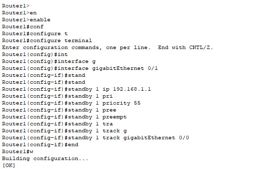
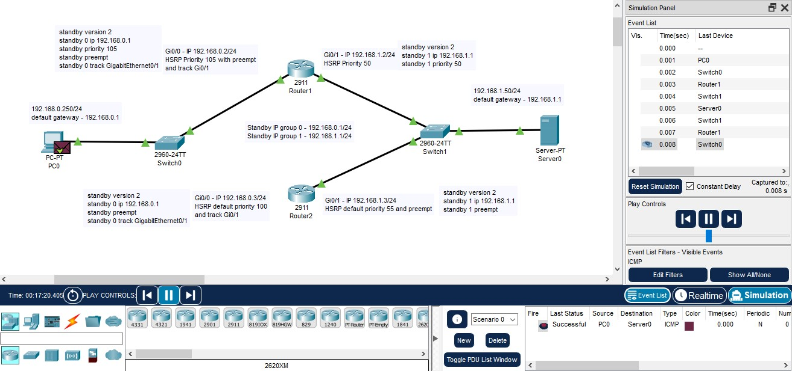
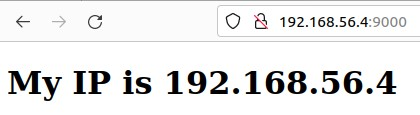
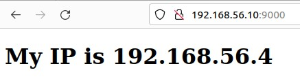
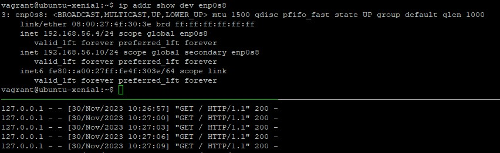
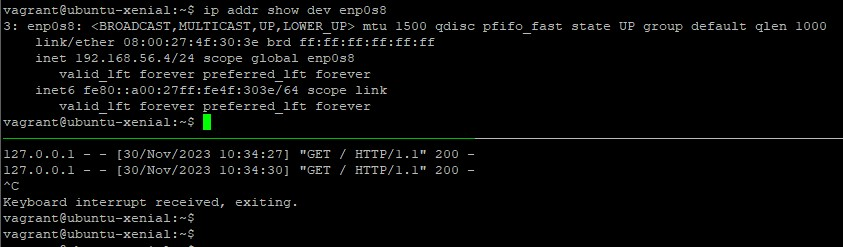
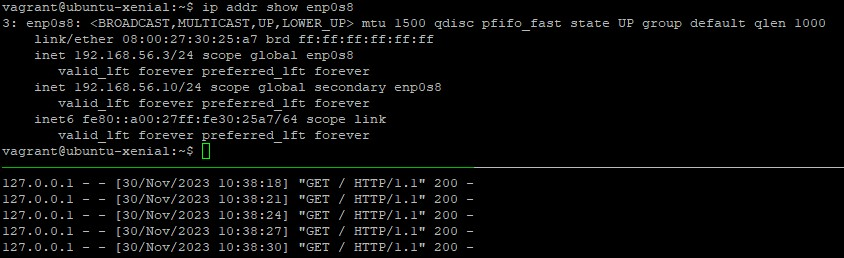
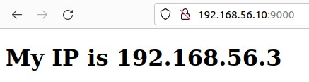

# Домашнее задание к занятию «Disaster Recovery. FHRP и Keepalived» - Михалёв Сергей

------


### Задание 1
- Дана [схема](https://drive.google.com/file/d/12HCqGj0GEOdQm8HUjHWmOr9zqryAMXFL/view?usp=sharing) для Cisco Packet Tracer, рассматриваемая в лекции.
- На данной схеме уже настроено отслеживание интерфейсов маршрутизаторов Gi0/1 (для нулевой группы)
- Необходимо аналогично настроить отслеживание состояния интерфейсов Gi0/0 (для первой группы).
- Для проверки корректности настройки, разорвите один из кабелей между одним из маршрутизаторов и Switch0 и запустите ping между PC0 и Server0.

#### Результат
- [Схема](https://drive.google.com/file/d/12LLh5TgpTgAH4TYutyjCgsFdtbzTLWgr/view?usp=sharing) в формате pkt.
- Скриншот процесса настройки маршрутизатора:
  *    
- [Схема](https://drive.google.com/file/d/12GgzHDYYFPm6gT1dABg0SeqD_spz903N/view?usp=sharing) с разорванной связью и скриншот отправки пакета на сервер и обратно:
  * 

------
### Задание 2
- Запустите две виртуальные машины Linux, установите и настройте сервис Keepalived как в лекции.
- Настройте любой веб-сервер (например, nginx или simple python server) на двух виртуальных машинах
- Напишите Bash-скрипт, который будет проверять доступность порта данного веб-сервера и существование файла index.html в root-директории данного веб-сервера.
- Настройте Keepalived так, чтобы он запускал данный скрипт каждые 3 секунды и переносил виртуальный IP на другой сервер, если bash-скрипт завершался с кодом, отличным от нуля (то есть порт веб-сервера был недоступен или отсутствовал index.html). Используйте для этого секцию vrrp_script

### Выполнение
- В папку */home/vagrant/* поместил файл *index.html* следующего содержания:
```
 <!DOCTYPE html>
<html>
<body>

<h1>My IP is 192.168.56.3</h1>

</body>
</html>
``` 
- Запустил *http* сервер командой
```
 python3 -m http.server 9000
```

- bash-скрипт проверки доступности *http* хоста по порту *9000* и проверки наличия *index.html* файла
```
#!/bin/bash
error=0

curl localhost:9000 || exit 1
[[ -f index.html ]] || exit 1

```
- конфигурационный файл keepalived
```
vrrp_script chk_myscript {
  script       "/home/vagrant/check-server.sh"
  weight 50
  interval 3   # check every 3 seconds
  fall 2       # require 2 failures for KO
  rise 2       # require 2 successes for OK
}

vrrp_instance VI_1 {
        state MASTER
        interface enp0s8
        virtual_router_id 10
        priority 200
        advert_int 1

        virtual_ipaddress {
              192.168.56.10/24
        }
        track_script {
              chk_myscript
        }
}

```
- Проверил достуцпность сервиса:
  *  
#### Результат

- Проверка доступности сервиса по плавающему *IP*:
  *  
- Наличие плавающего адреса на интерфейсе компьютера *master*:
  * 
- После остановки сервера компьютер *master* теряет плавающий адрес:
  * 
- Адрес *192.168.56.10* получает второй компьютер:
  * 
- Теперь страница в браузере выгляит по иному:
  * 


------
